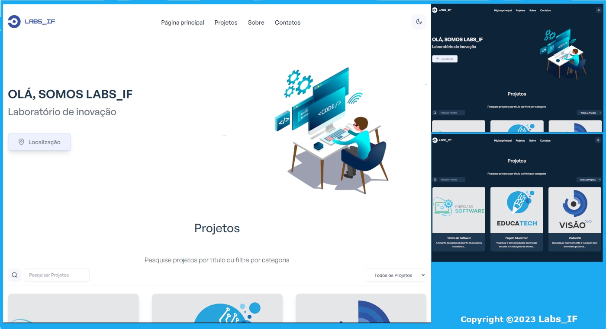
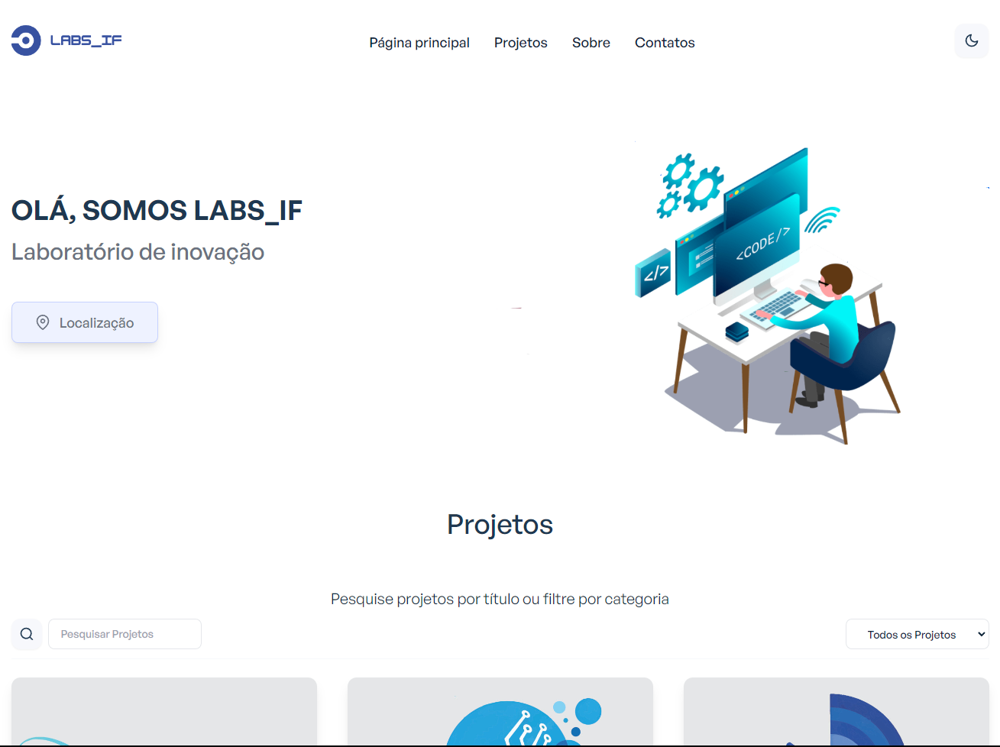
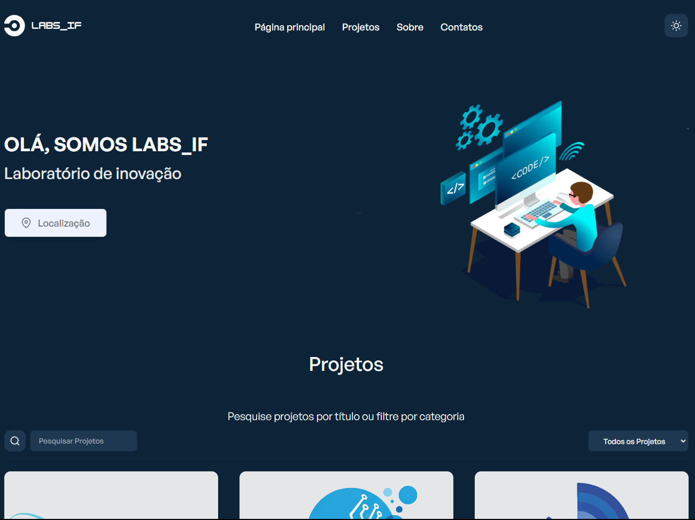
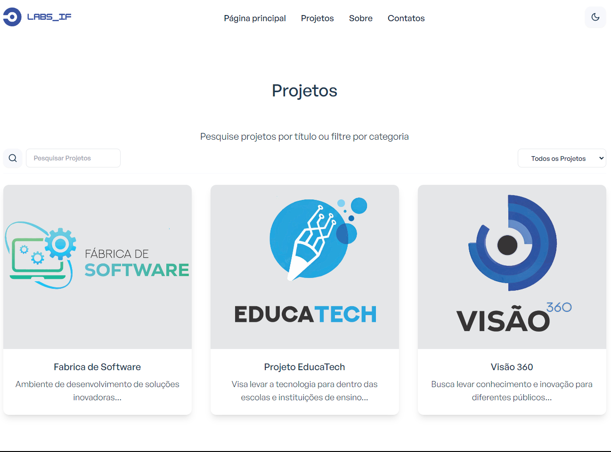
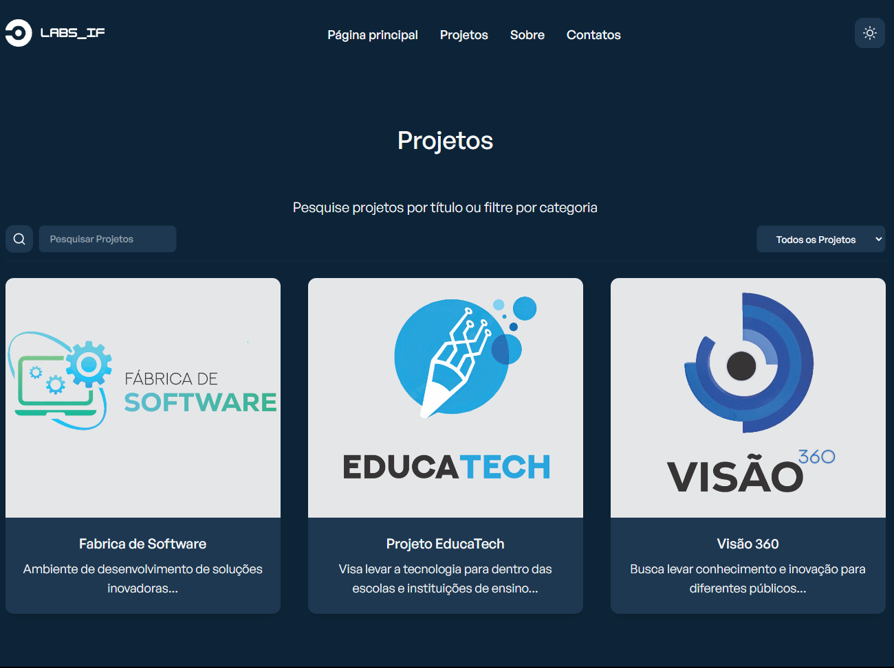

<h1 align="center">Labs_IF Landing page (Temporária)</h1>
<h3 align="center">Laboratório de inovação</h3>
<p align="center">

</p>
<br>
<p>Layout temporário da Landing Page do Labs_IF construído com o React e o Tailwind CSS.</p>

## Configuração

1. Verifique se você possui o Node JS instalado. Se você não tiver:

-   [Faça o download em nodejs.org](https://nodejs.org)

4. Instale pacotes e dependências:

```
yarn install
```

4. NOTA: Se você não possui yarn instalado, pode instalá-lo globalmente usando npm:

```
npm install --global yarn
```
4. NOTA: Se você não possui yarn instalado, pode instalá-lo globalmente usando npm:

```
npm install --global yarn
```

5. Inicie um servidor dev local em `http://localhost:3000`:

```
yarn start
```

6. ##### Executar testes:

```
yarn test
```

<h3>Recursos:</h3>

- React com react router v6
- Tailwind CSS v3
- API de contexto para gerenciamento de estado
- Hooks personalizados
- Teste de unidade
- Transições e animações de movimento Framer
- Componentes reutilizáveis
- Modo Dark
- Filtro de projetos por categoria
- Filtro de projetos por pesquisa
- Rolagem suave
- Contra-contador
- Formas dinâmicas
- Botão voltar ao topo
- Botão Localizar
- Design simples e responsivo

<h3>Tecnologias utilizadas:</h3>

####


<p align="center"></p>
<p align="center"></p>
<p align="center"></p>
<p align="center"></p>
<footer>
<p align="center">
Copyright © Labs_IF, 2023 Landing Page
</p>
</footer>